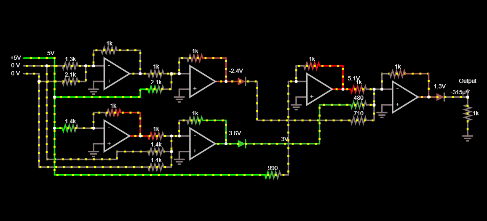

# Realnet

[Run This Circuit!](https://www.falstad.com/circuit/circuitjs.html?ctz=CQAgjCAMB0l3BWcMBMcUHYMGZIA4UA2ATmIxAUgosgCgwMUoQAWPEAWmybefKSRUh0JAA16jZoRaduIaX2aDmMJAE1aAJWZyuTOUNZVlwhLQDuzXmEKt2dAIbgWMhWnYL2YJB2-J4cFCw8Nh4LISQhBhsCDjR+MxgAXSWNnYgcrwpGTzsvFkW6bwKBQBO8jK8xLZZ4LjZYCh5Xi7pDU3pjV622e4VICgorjK9Q-2DMmnt3c6TPbTlYK1pDLZT-g0Ya7YT4POprXhUXSBHULQA5uAdZyfVKgv9Z-dnVChJ2VRyaQaFVAppBQNWwA2yvQppM5ycGWaFUXgw9JnTxCQr3ayNNoQzHWDoFVI4ryYxFgYlUF6o1K2OQ0pijYYDFj-EaPIbMgaSIEbQqYJhuPAeFlObhUKFhU6i8A+PwfAKcGABJaESgYAVEaREBDYRLJHkC-q4BnZQ0GtD9Y2QBkm36wy05HJfOmPEX27AIfR07mw932pmO86WP2+wJnFCFUIyM5BxFNQUDfX3XoJnaSROs1M7JkgRMDD48sakpi7NOWYuZ8n7V25e1hwNEosFzGOWbgYhFhJgNunKWcGXJYQBN0YMDYKLYFgYYgC7CdnUBHkdru7TtO0sFpcF1oNZZba5eXfTcC7k5LFmpDqnluXuiLZbLLvXr2tpiX5db-OTJdZlcBvdHtaYqsv6Fv+2ZrAejz3EBAIHs4cAQq0fQnH0dBXMhHYdLslLpJk9a-hi1ZAdk1i7jB8zlGyz4ci+XbHPAPKSD+sZUUmXhLvqWF6uwuzMSgCCVrxYy8gMYysQM-HUeJAn6j+Jo-han4esctG0MKZp9BGAwJF40pILK8DyNAjTvOOjTYNgxAsN4hAAKa+IY+kKVRckRL+LmOscrk3g6exfD6NgOfR3ovq5QYBfhgThUGfS1kYbwJJpKHhma9wmmmVxpdSdogdhLq7CanEZXa+XFVmqIUZIPFZlhcHecJfHllJiR+jy1UFrunGpB17WNZsjVyJRxpFlmuHAWCnlNcCTWUQ1EXxXkaRJYGIbwpCqIACasGtrAIm84AAHKxKStCbVZOwJC43EJC+h3DmAhSXVp7AIEu12PMqawdIQMkdPCRzvRJ4Xfd0hjDtkCCtLw-F-ec5TQ+kL3VnR8FOPD9yEGMLw9r4en9kEASUJQTJutwKBtoQ45zkFFBdsUWb4hUMPSBWAyFMzYHyJjlbwyBEOTE2lwUMsmJ83+2Hs+jElpuUH0c8DHPI9k8v3Bgdppk4OAAUwRzHMS2N9sk8rBHAo7eCwoTvPgpBDFyjmFKrMgqyllaMCzrvmvbZoKJrHvlD73vfeaT7uyro4K-bgeeICZ6nNHsda6zlh4CsZK66uIA+yc7snKhGdmln+dbr+ycJ3g3wC5tZcvsSBEDAdR33Untd4ACAtJ632tQZisV4F3neffYjy9wPpxQV5T7D75o-gfMVyT0B8+0fh+41NxkjZA7HObzn9vZV9P2D+UbBvJICDd+v2bEODrlnKLiKi1DhzYXfxg3M-b8UJh6+FO6a9MGfRZv51hPtWYSStAYdERmLH+D5IEPnfJYeW4Vt5eV3nMKg29fps0BqFUE2FHpRhRPhIh4R0G-igX0KB15aBoHIPPYkFJWAgAAPIAFcAAuAAHDhtAgA)

This is a side project I started after being fascinated with [analog computers](https://en.wikipedia.org/wiki/Analog_computer). I set out to create a neural network in real life with simple parts. Above, you can see a Pytorch model trained on XOR that I converted to a circuit.

### Progress, Ideas, and Current Implementation

The current milestone as of `2/12/2021` is that I was successfully able to create a circuit that implemented the XOR network that I trained in Pytorch. Some initial ideas I explored were analog multipliers, which after considering the fact I wanted to build one of these in real life, became impractical. Then I decided the weights would be static and switched my approach for voltage multiplication to an [inverted op amp summer](https://www.electronics-tutorials.ws/opamp/opamp_4.html). Inverted op amp summers are perfect for the job because they sum the voltages (+ and - voltages still cancel out!) and they can be weighted, just like a neuron’s input can be weighted! To learn more about how the actual weighting, summing, and inverting works, follow the link to the inverted op amp summer above (it’s surprisingly simple). So the op amp weighted summer circuit actually implements most of the functions of the neuron, namely, multiplying by weights, and summing the inputs. Now anyone knows that the neuron needs a nonlinear activation function so that it doesn’t experience layer collapse (short explanation: without the non-linear activation, a NN is just a composition of linear transformations, so they can be multiplied out into one transformation). Luckily, there is a popular activation function that is cheap, and simple to implement: [ReLU](https://en.wikipedia.org/wiki/Rectifier_(neural_networks)). ReLU functions essentially like a perfect diode, blocking current flow into the negative direction. This fully encapsulates all the components needed to create a neural network. The minimum number of op amps needed for a neuron is one, but this means that all the weights, including the bias, that connect to the neuron must be negative.

### Todo

These are some things that I hope to accomplish.

1. ~~Figure out basic design mechanisms like adding, multiplying, and non-linear~~
2. ~~Actually design circuit that works in simulation~~
3. Bigger net
4. Physical prototype
5. **Automatic transcription**